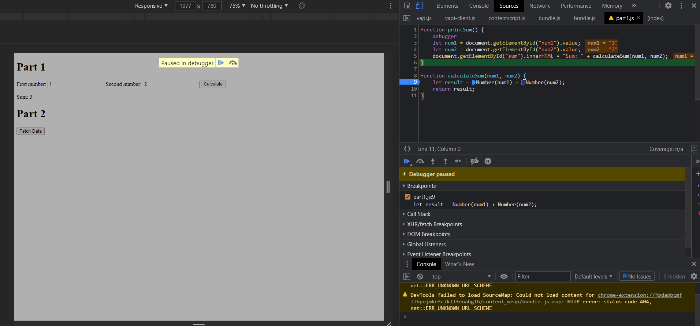

1. The bug is that result is concatenating num1 and num2 instead of calculating the sum of the two

Network Tab:
3. citylots.json
4. part2.js
5. 11.7 MB
6. 2.12 s

7. Mozilla
8. Apache
9. Tue, 26 Jan 2021 22:14:13 GMT
10. application/json
11. function fetchData();
